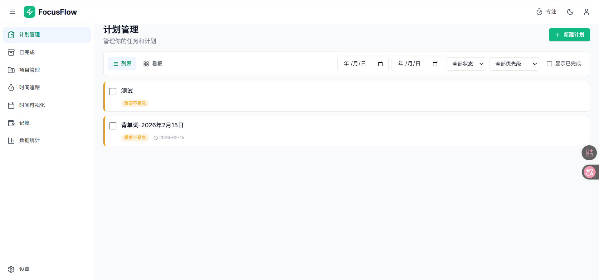
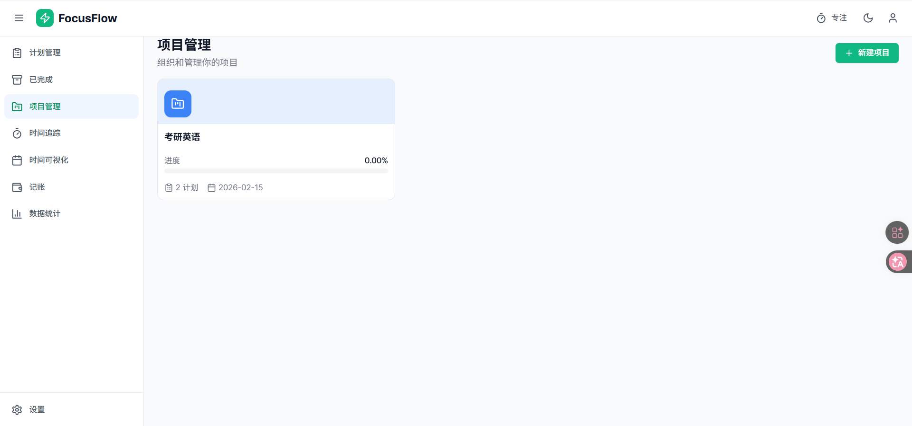
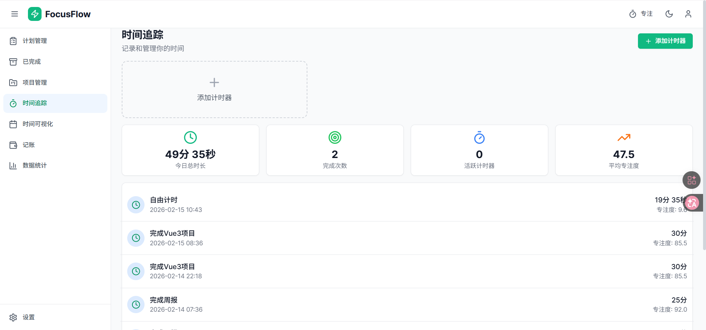
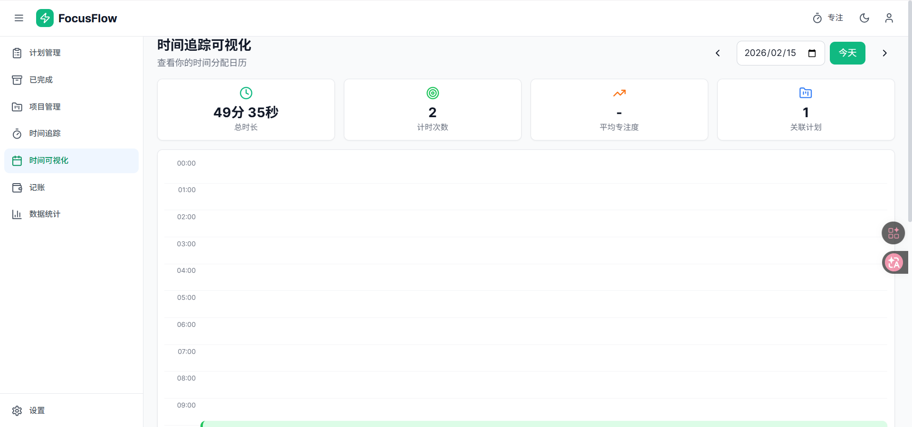
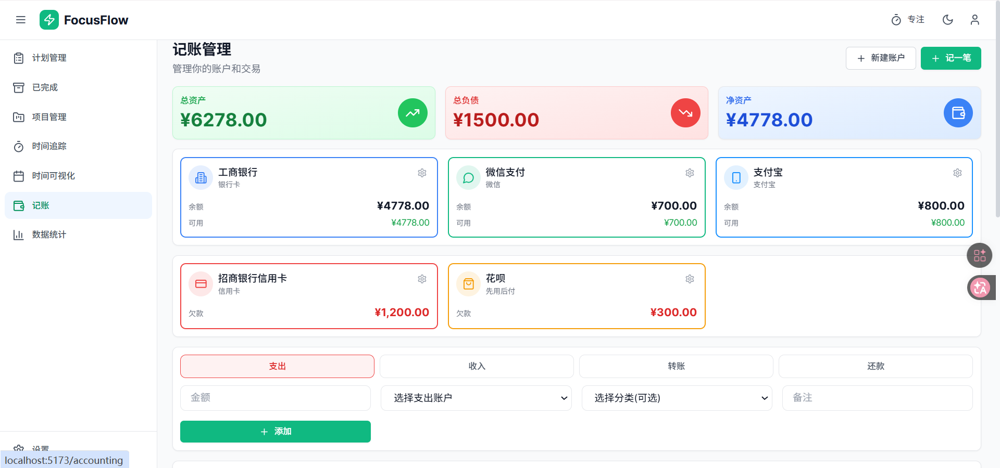
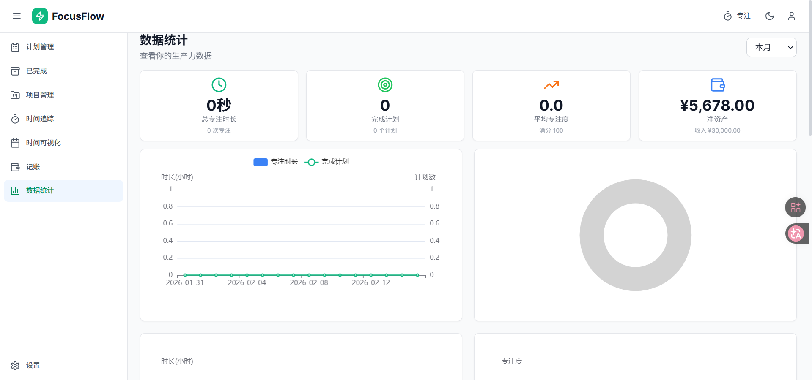
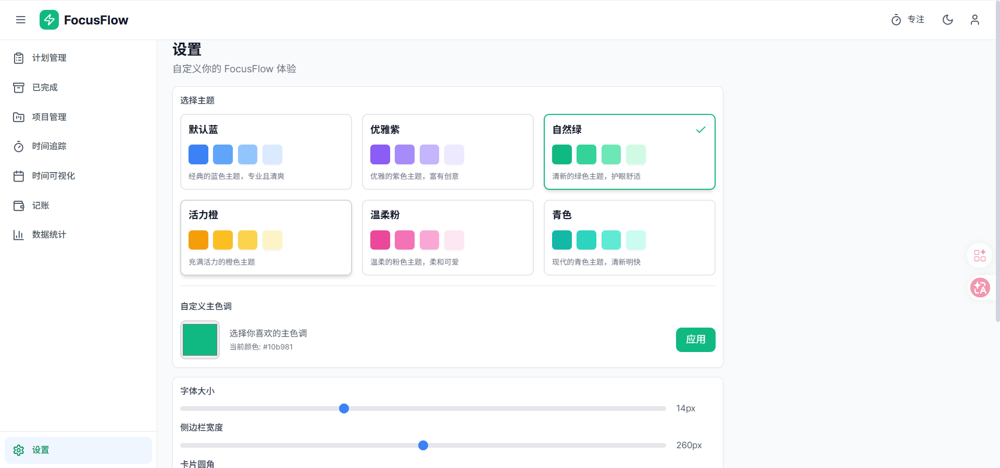

<div align="center">

# 🎯 FocusFlow

**现代化的 All-in-One 生产力管理平台**

[](LICENSE)
[](https://www.python.org/)
[](https://vuejs.org/)
[](https://www.typescriptlang.org/)
[](https://github.com/features/copilot)

[功能特性](#-功能特性) • [快速开始](#-快速开始) • [技术栈](#-技术栈) • [截图预览](#-截图预览) • [文档](#-文档)

</div>

---

## 📖 简介

FocusFlow 是一个集成了**任务管理**、**时间追踪**、**数据统计**和**财务管理**的现代化生产力平台。采用前后端分离架构，提供流畅的用户体验和强大的功能支持。

### 🤖 AI 辅助开发

> **本项目 90% 的代码由 AI 辅助完成**

FocusFlow 是一个展示 AI 辅助开发能力的实践项目，使用 **Kiro (Claude Sonnet 4.5)** 进行 Vibe Coding：

- 🎨 **需求驱动** - 通过自然语言描述需求，AI 自动生成代码
- � **快速迭代** - 从想法到实现，平均每个功能 10-30 分钟
- � **智能调试** - AI 自动诊断问题并提供解决方案
- � **自动文档** - 代码和文档同步生成，保持一致性
- ✨ **最佳实践** - AI 遵循行业最佳实践和设计模式

**开发历程：**
- 总开发时间：约 8 小时
- 功能模块：8 个主要模块
- 代码行数：~15,000 行
- AI 贡献：~90% 的代码由 AI 生成
- 人工参与：需求描述、功能验证、体验优化

**AI 辅助的典型工作流：**
1. 用自然语言描述需求："我需要一个支持多账户的记账系统"
2. AI 自动设计数据模型、API 接口、前端页面
3. AI 生成完整的实现代码
4. 人工测试并提出改进建议
5. AI 快速迭代优化

这种开发方式大大提高了开发效率，让开发者可以专注于产品设计和用户体验，而不是陷入繁琐的代码细节。

### 🌟 为什么选择 FocusFlow？

- 🎨 **现代化设计** - 简洁优雅的界面，支持浅色/深色主题
- ⚡ **高性能** - 基于 Vue 3 和 FastAPI，响应迅速
- 🔧 **高度可定制** - 6 种主题预设，自定义颜色、字体、圆角
- 📊 **数据可视化** - 丰富的图表和统计分析
- 💰 **财务管理** - 完整的账户系统，支持多账户、转账、还款
- 🕐 **时间追踪** - 多计时器并行，日历可视化
- 🌙 **深色模式** - 保护眼睛，适合夜间使用

## ✨ 功能特性

### 📋 计划管理
- ✅ **四象限优先级** - 基于艾森豪威尔矩阵的任务分类
- ✅ **智能筛选** - 按状态、优先级、项目、时间范围筛选
- ✅ **时间冲突检测** - 自动检测计划时间冲突
- ✅ **已完成归档** - 独立的归档页面管理已完成计划
- ✅ **项目关联** - 将计划关联到具体项目



### 📁 项目管理
- ✅ **项目看板** - 可视化项目卡片展示
- ✅ **进度追踪** - 实时显示项目完成进度
- ✅ **颜色主题** - 为每个项目设置独特颜色
- ✅ **统计信息** - 项目时长、计划数量统计



### ⏱️ 时间追踪
- ✅ **多计时器** - 支持多个计时器同时运行
- ✅ **计划绑定** - 计时器可绑定到具体计划
- ✅ **日历可视化** - 24 小时时间轴展示每日时间分配
- ✅ **专注度评分** - 根据专注度自动着色
- ✅ **实时统计** - 每日时长、次数、平均专注度




### 💰 财务管理
- ✅ **多账户系统** - 支持资产账户和负债账户
- ✅ **交易类型** - 收入、支出、转账、还款
- ✅ **自动余额** - 所有交易自动更新账户余额
- ✅ **账户详情** - 独立的账户详情页面，查看交易记录
- ✅ **财务汇总** - 总资产、总负债、净资产统计




### 📊 数据统计
- ✅ **9 种图表** - 时间趋势、完成率、项目分布、专注度等
- ✅ **时间筛选** - 每个图表独立的时间筛选器
- ✅ **热力图** - GitHub 风格的时间热力图
- ✅ **收支分析** - 收支趋势、分类占比
- ✅ **优先级分布** - 雷达图展示计划优先级



### ⚙️ 设置与主题
- ✅ **6 种主题预设** - 蓝、紫、绿、橙、粉、青
- ✅ **自定义颜色** - 颜色选择器自由定制
- ✅ **深色模式** - 完整的深色主题支持
- ✅ **显示设置** - 字体大小、卡片圆角、紧凑模式
- ✅ **动画控制** - 可关闭动画提升性能




## 🛠️ 技术栈

<table>
<tr>
<td width="50%">

### 后端技术
- 🐍 **Python 3.11+**
- ⚡ **FastAPI** - 现代化的 Web 框架
- 🗄️ **SQLAlchemy 2.0** - 异步 ORM
- 💾 **SQLite** - 轻量级数据库
- 🔄 **Pydantic** - 数据验证
- 📝 **Uvicorn** - ASGI 服务器

</td>
<td width="50%">

### 前端技术
- 💚 **Vue 3.4+** - Composition API
- 📘 **TypeScript 5.0+**
- ⚡ **Vite 5.0** - 极速构建工具
- 🎨 **Tailwind CSS 3.4** - 原子化 CSS
- 🍍 **Pinia** - 状态管理
- 📊 **ECharts 5.5** - 数据可视化
- 🎭 **Lucide Icons** - 图标库

</td>
</tr>
</table>

## 🚀 快速开始

### 📋 环境要求

| 工具 | 版本要求 |
|------|---------|
| Python | 3.11+ |
| Node.js | 18+ |
| npm | 9+ |

### 💻 安装步骤

#### 克隆项目

```bash
git clone https://github.com/yourusername/focusflow.git
cd focusflow
```


#### 手动启动

<details>
<summary>展开查看详细步骤</summary>

**后端启动：**
```bash
cd backend

# 创建虚拟环境
python -m venv venv

# 激活虚拟环境
# Windows:
venv\Scripts\activate
# Linux/Mac:
source venv/bin/activate

# 安装依赖
pip install -r requirements.txt

# 初始化示例数据（可选）
python init_data.py

# 启动服务
python -m uvicorn app.main:app --reload --host 0.0.0.0 --port 8000
```

**前端启动：**
```bash
cd frontend

# 安装依赖
npm install

# 启动开发服务器
npm run dev
```

</details>

#### 访问应用

| 服务 | 地址 | 说明 |
|------|------|------|
| 🌐 前端界面 | http://localhost:5173 | 主应用界面 |
| 🔌 后端 API | http://localhost:8000 | API 服务 |
| 📚 API 文档 | http://localhost:8000/docs | Swagger 文档 |

### 🎬 首次使用

1. 访问 http://localhost:5173
2. 系统会自动创建示例数据
3. 开始探索各项功能！

> 💡 **提示**: 首次启动可能需要 10-15 秒，请耐心等待

## 📁 项目结构

```
focusflow/
├── backend/                    # 后端服务
│   ├── app/
│   │   ├── models/            # SQLAlchemy 数据模型
│   │   │   ├── plan.py        # 计划模型
│   │   │   ├── project.py     # 项目模型
│   │   │   ├── timer.py       # 计时模型
│   │   │   ├── account.py     # 账户模型
│   │   │   └── transaction.py # 交易模型
│   │   ├── schemas/           # Pydantic 验证模型
│   │   ├── routers/           # API 路由
│   │   │   ├── plans.py       # 计划路由
│   │   │   ├── projects.py    # 项目路由
│   │   │   ├── timer.py       # 计时路由
│   │   │   ├── accounting.py  # 记账路由
│   │   │   └── statistics.py  # 统计路由
│   │   ├── services/          # 业务逻辑层
│   │   ├── database.py        # 数据库配置
│   │   ├── config.py          # 应用配置
│   │   └── main.py            # 应用入口
│   ├── requirements.txt       # Python 依赖
│   ├── init_data.py          # 初始化数据脚本
│   └── focusflow.db          # SQLite 数据库
│
├── frontend/                  # 前端应用
│   ├── src/
│   │   ├── components/       # 可复用组件
│   │   │   ├── common/       # 通用组件
│   │   │   ├── layout/       # 布局组件
│   │   │   ├── plans/        # 计划组件
│   │   │   ├── projects/     # 项目组件
│   │   │   ├── timer/        # 计时组件
│   │   │   ├── accounting/   # 记账组件
│   │   │   └── statistics/   # 统计组件
│   │   ├── views/            # 页面视图
│   │   │   ├── PlansView.vue
│   │   │   ├── ProjectsView.vue
│   │   │   ├── TimeTrackingView.vue
│   │   │   ├── TimeTrackingCalendarView.vue
│   │   │   ├── AccountingView.vue
│   │   │   ├── StatisticsView.vue
│   │   │   └── SettingsView.vue
│   │   ├── stores/           # Pinia 状态管理
│   │   ├── api/              # API 接口封装
│   │   ├── router/           # Vue Router 配置
│   │   ├── types/            # TypeScript 类型定义
│   │   ├── utils/            # 工具函数
│   │   ├── style.css         # 全局样式
│   │   └── main.ts           # 应用入口
│   ├── package.json          # npm 依赖
│   ├── vite.config.ts        # Vite 配置
│   ├── tailwind.config.js    # Tailwind 配置
│   └── tsconfig.json         # TypeScript 配置
│
├── doc/                       # 文档目录
│   ├── img/                  # 截图和图片
│   └── *.md                  # 各类文档
│
├── start.sh                   # Linux/Mac 启动脚本
├── start.bat                  # Windows 启动脚本
├── restart_services.bat       # 重启服务脚本
└── README.md                  # 项目说明
```

## 🔌 API 接口

完整的 RESTful API 设计，支持所有核心功能。

<details>
<summary>📋 计划管理 API</summary>

| 方法 | 路径 | 说明 |
|------|------|------|
| GET | `/api/v1/plans` | 获取计划列表（支持筛选） |
| POST | `/api/v1/plans` | 创建新计划 |
| GET | `/api/v1/plans/{id}` | 获取计划详情 |
| PUT | `/api/v1/plans/{id}` | 更新计划 |
| DELETE | `/api/v1/plans/{id}` | 删除计划 |
| POST | `/api/v1/plans/{id}/complete` | 标记计划完成 |

</details>

<details>
<summary>📁 项目管理 API</summary>

| 方法 | 路径 | 说明 |
|------|------|------|
| GET | `/api/v1/projects` | 获取项目列表 |
| POST | `/api/v1/projects` | 创建新项目 |
| GET | `/api/v1/projects/{id}` | 获取项目详情 |
| PUT | `/api/v1/projects/{id}` | 更新项目 |
| DELETE | `/api/v1/projects/{id}` | 删除项目 |

</details>

<details>
<summary>⏱️ 时间追踪 API</summary>

| 方法 | 路径 | 说明 |
|------|------|------|
| GET | `/api/v1/timer/active` | 获取活动计时器 |
| POST | `/api/v1/timer/create` | 创建计时器 |
| POST | `/api/v1/timer/{id}/start` | 开始计时 |
| POST | `/api/v1/timer/{id}/pause` | 暂停计时 |
| POST | `/api/v1/timer/{id}/stop` | 停止计时 |
| GET | `/api/v1/timer/sessions` | 获取计时记录 |
| GET | `/api/v1/timer/stats/today` | 今日统计 |

</details>

<details>
<summary>💰 财务管理 API</summary>

| 方法 | 路径 | 说明 |
|------|------|------|
| GET | `/api/v1/accounts` | 获取账户列表 |
| POST | `/api/v1/accounts` | 创建账户 |
| GET | `/api/v1/accounts/{id}` | 获取账户详情 |
| PUT | `/api/v1/accounts/{id}` | 更新账户 |
| DELETE | `/api/v1/accounts/{id}` | 删除账户 |
| GET | `/api/v1/accounting/transactions` | 获取交易记录 |
| POST | `/api/v1/accounting/transactions` | 创建交易 |
| GET | `/api/v1/accounting/summary` | 财务汇总 |

</details>

<details>
<summary>📊 数据统计 API</summary>

| 方法 | 路径 | 说明 |
|------|------|------|
| GET | `/api/v1/statistics/overview` | 概览统计 |
| GET | `/api/v1/statistics/time-trend` | 时间趋势 |
| GET | `/api/v1/statistics/plan-completion` | 计划完成率 |
| GET | `/api/v1/statistics/project-time` | 项目时间分布 |
| GET | `/api/v1/statistics/focus-trend` | 专注度趋势 |
| GET | `/api/v1/statistics/heatmap` | 时间热力图 |
| GET | `/api/v1/statistics/finance-trend` | 收支趋势 |
| GET | `/api/v1/statistics/expense-category` | 支出分类 |

</details>

> 📚 完整 API 文档请访问: http://localhost:8000/docs

## 🎨 设计规范

### 色彩系统
- 主色: `#3b82f6` (蓝色)
- 成功: `#10b981` (绿色)
- 警告: `#f59e0b` (橙色)
- 危险: `#ef4444` (红色)

### 四象限颜色
- Q1 紧急重要: `#ef4444` (红)
- Q2 重要不紧急: `#f59e0b` (橙)
- Q3 紧急不重要: `#3b82f6` (蓝)
- Q4 不重要不紧急: `#6b7280` (灰)

## 📝 开发计划

### ✅ 已完成

- [x] 基础架构搭建
- [x] 后端 API 开发
- [x] 前端页面开发
- [x] 计划管理模块（四象限、筛选、归档）
- [x] 项目管理模块（进度追踪、颜色主题）
- [x] 时间追踪模块（多计时器、日历可视化）
- [x] 数据统计模块（9 种图表、时间筛选）
- [x] 财务管理模块（多账户、转账、还款）
- [x] 设置系统（主题、深色模式、自定义）
- [x] 错误处理和恢复机制
- [x] 性能优化（并行 API、预加载）

### 🚧 进行中

- [ ] 用户认证系统
- [ ] 数据导出功能（Excel、CSV、JSON）
- [ ] 移动端响应式优化
- [ ] PWA 支持（离线使用）

### � 计划中

- [ ] 多用户支持
- [ ] 数据同步（云端）
- [ ] 团队协作功能
- [ ] 提醒和通知
- [ ] 数据备份和恢复
- [ ] 插件系统
- [ ] 国际化（i18n）
- [ ] 桌面客户端（Electron）

## 🎨 设计规范

### 色彩系统

| 用途 | 颜色 | Hex |
|------|------|-----|
| 主色 | 蓝色 | `#3b82f6` |
| 成功 | 绿色 | `#10b981` |
| 警告 | 橙色 | `#f59e0b` |
| 危险 | 红色 | `#ef4444` |
| 信息 | 青色 | `#06b6d4` |

### 四象限颜色

| 象限 | 说明 | 颜色 | Hex |
|------|------|------|-----|
| Q1 | 紧急且重要 | 红色 | `#ef4444` |
| Q2 | 重要不紧急 | 橙色 | `#f59e0b` |
| Q3 | 紧急不重要 | 蓝色 | `#3b82f6` |
| Q4 | 不紧急不重要 | 灰色 | `#6b7280` |

### 主题预设

1. **默认蓝** - `#3b82f6` - 经典专业
2. **优雅紫** - `#8b5cf6` - 富有创意
3. **自然绿** - `#10b981` - 护眼舒适
4. **活力橙** - `#f59e0b` - 充满活力
5. **温柔粉** - `#ec4899` - 柔和可爱
6. **青色** - `#14b8a6` - 清新明快


## 🤝 贡献指南

欢迎贡献代码、报告问题或提出建议！

### 如何贡献

1. Fork 本仓库
2. 创建特性分支 (`git checkout -b feature/AmazingFeature`)
3. 提交更改 (`git commit -m 'Add some AmazingFeature'`)
4. 推送到分支 (`git push origin feature/AmazingFeature`)
5. 开启 Pull Request

### 代码规范

- **Python**: 遵循 PEP 8
- **TypeScript**: 使用 ESLint 和 Prettier
- **Vue**: 遵循 Vue 3 风格指南
- **提交信息**: 使用语义化提交信息

### 报告问题

提交 Issue 时请包含：
- 问题描述
- 重现步骤
- 预期行为
- 实际行为
- 截图（如适用）
- 环境信息（操作系统、浏览器版本等）

## 📄 许可证

本项目采用 MIT 许可证 - 查看 [LICENSE](LICENSE) 文件了解详情

## 🙏 致谢

### 开源项目

感谢以下优秀的开源项目：

- [Vue.js](https://vuejs.org/) - 渐进式 JavaScript 框架
- [FastAPI](https://fastapi.tiangolo.com/) - 现代化的 Python Web 框架
- [Tailwind CSS](https://tailwindcss.com/) - 实用优先的 CSS 框架
- [ECharts](https://echarts.apache.org/) - 强大的数据可视化库
- [Lucide Icons](https://lucide.dev/) - 精美的图标库
- [Pinia](https://pinia.vuejs.org/) - Vue 状态管理
- [SQLAlchemy](https://www.sqlalchemy.org/) - Python SQL 工具包

---

<div align="center">

**⭐ 如果这个项目对你有帮助，请给一个 Star！⭐**

[⬆ 回到顶部](#-focusflow)

</div>
